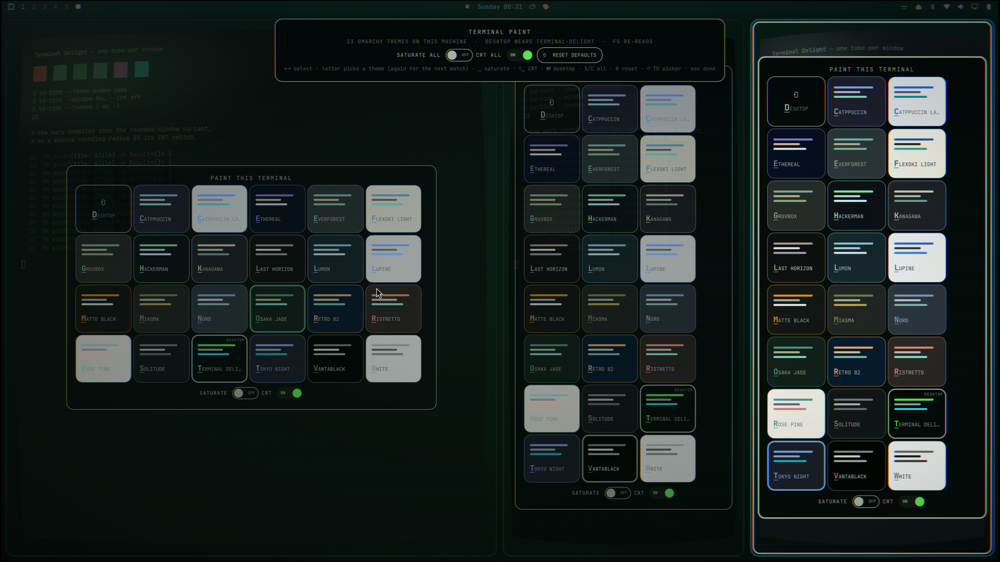
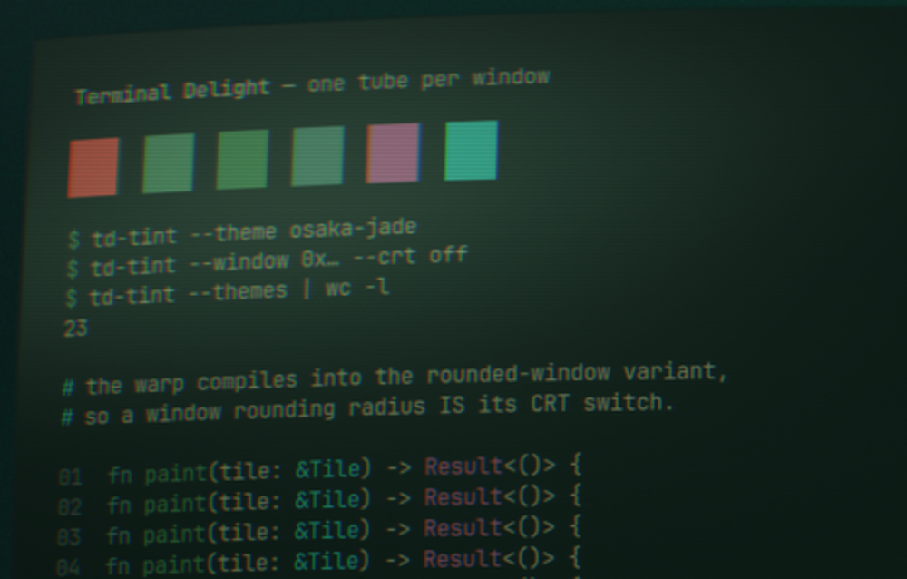

# Terminal Paint

**Give every terminal on the workspace its own Omarchy theme — and its own tube.**



Click the palette in the bar and each terminal tile grows a picker card holding
every theme installed on the box — Osaka Jade, Vantablack, Tokyo Night,
whatever you have. Click one and *that tile* wears it. Same colours the theme
grid would put on the whole desktop; the only difference is how far they reach.

Each card **is** its theme: filled with that theme's background, ruled with its
accent and foreground, and labelled in the colour that theme writes text in. If
the name is hard to read on the card, the terminal will be hard to read too, and
you have learned that before clicking rather than after.

A rail across the top acts on every tile at once — **SATURATE ALL**, **CRT ALL**,
**RESET DEFAULTS**, one per line with its chord beside it — and tells you how
many themes this machine has and which one the desktop is wearing. Each tile
carries the same three across its own card.

- **foot / Alacritty / kitty / Ghostty / WezTerm** — the card floats over the
  window; a pick runs `td-tint --window <address> --theme <name>`, which writes
  that theme's OSC palette down the terminal's own tty and puts the matching
  gradient on its window border. Runtime-only, dies with the window; the ↩
  DESKTOP card hands the tile back to the desktop theme.
- **Terminal Delight** — its story is better than a window tint (per-pane,
  persistent, CRT-identity-preserving), so its card is a single handoff that
  raises TD's own in-app pane picker over its control socket and gets out of the
  way.

Esc, or a click on the dimmed background, or a second click on the palette:
brushes away everywhere.

## The tube, per tile



Terminal Delight's desktop half draws every window as curved glass — a barrel
warp and a glass glare, one tube per window. **CRT** turns that on or off for
one tile; **CRT ALL** does the workspace.

(The overlay screenshot above cannot show this: layer-shell surfaces are not
warped, so a picture *of* the picker never contains the thing the switch turns
on. This is a bare pane.)

It works because of where the warp lives. `shaders/surface.frag` compiles its
warp and glare only into the *rounded-window* variant, so a window's rounding
radius is its CRT power switch. That is not a trick — it is the only live lever
there is. A window shader is loaded with Hyprland's config, so swapping it
means editing a file and reloading the compositor — not something a picker can
do per tile, per click — and the *screen* shader can only be swapped at the
cost of wedging `wlr-screencopy` for hours. Rounding is a
per-window property the compositor already honours, live, per window, and it is
exactly the one the shader keys off.

On a box where that warp is not installed, the CRT switches are **absent** rather
than present and inert. `td-tint --state` reports whether the shader is there.

## The list is this machine's, right now

There is no bundled theme list and nothing is cached. `td-tint --state` globs the
theme directories at the moment you press the key, so a theme installed a minute
ago is on the grid and one uninstalled a minute ago is gone. The rail prints the
count, which is that guarantee said out loud rather than promised in a README.

`F5` re-reads without closing — for when the `omarchy theme install` happened in
the window behind this overlay.

The theme the desktop itself is wearing is **marked**, not hidden. It is a
perfectly good thing to paint a tile with, and knowing which card it is turns the
grid from a wall of colours into a set of deviations from something.

## What this plugin runs, reads, and sends

Plugins are unsandboxed, so here is the whole footprint:

- **Runs, on summon:** one command — `td-tint --state`, the oracle that reports
  the installed themes, the desktop's own theme, whether the warp is installed,
  and where the terminal tiles are. **Runs, on a card click or a switch:**
  `td-tint --window …` (`--theme`, `--clear`, `--saturate`, `--crt`) or
  `terminal-delight ctl paint …`. **Runs, on an empty workspace:** one transient
  `notify-send` saying so. Nothing resident, nothing polled.
- **Every one of those is an argv array.** No `bash -c`, no shell string, no
  string-form `execDetached` anywhere in the file — there is no place for a word
  to be re-split or re-interpreted on its way to a process.
- **Reads:** nothing beyond those command outputs. **Writes:** nothing.
  **Network:** none, ever.
- While the overlay is up it holds exclusive keyboard focus (that is what makes
  Esc work); it releases everything on dismiss.

### What it trusts, and what it checks

The theme list is not ours in any sense. The names are **directory names** from
`~/.config/omarchy/themes` and Omarchy's own share — anyone's, including a theme
cloned from a stranger's repo an hour ago — and the colours are whatever that
theme's `colors.toml` says. It reaches this plugin over a pipe, so `--state`
output is treated as third-party input and normalised by one function at one
boundary before anything downstream sees it:

| Field | Accepted | Why it matters |
|---|---|---|
| `key` | `^[a-z0-9][a-z0-9-]{0,31}$` | it is an argv word — so it may carry no markup, and may never begin with `-` |
| `label` | plain text, ≤ 28 chars, control characters stripped | drawn, never executed; it is also the letter the keyboard matches |
| `accent`, `partner`, `bg`, `fg` | `#rgb` / `#rrggbb` / `#aarrggbb` | they land in a string→color coercion, and `bg` is drawn across a whole card |
| `desktop_theme` | the same `key` regex | it decides which card gets marked, so it gets the same gate as a card |
| window address | `^0x[0-9a-f]{1,16}$` | it is the argv word behind `--window`, and a filename inside `td-tint`'s run dir |

A record that does not fit is dropped, not repaired. Card labels are built from
plain `Text` items with font properties — the draw path never assembles markup,
so there is nothing for a hostile name to be rendered as. The snapshot read is
gated on the collector draining rather than on a timer, and a document past
256 KiB is discarded unparsed.

## Requirements

- **`td-tint`** on `PATH`, current enough to report `themes`, `crt` and
  `desktop_theme` from `td-tint --state` and to accept `--theme` and `--crt`
  ([omarchy-terminal-delight-theme](https://github.com/parker-brown-family/omarchy-terminal-delight-theme)
  **v0.3.0 or later** → `./install-variants.sh` installs it).
- **For the CRT switches:** the per-window warp, from that same repo's
  `./install-curve.sh` — which reloads Hyprland for you, no relogin. Without
  it the switches are simply not drawn.

If a switch is missing or a card is the wrong colour, that repo's `./bin/doctor`
says which of those requirements is not actually met on your box, and how to fix
it. A hidden CRT switch and a broken one look identical from here.
- **For Terminal Delight windows:** a `terminal-delight` build with the control
  socket (`feat/td-paint-mode` or later). Terminals started from older builds
  can't be reached — reopen them.

## Buttons

| Button | Means |
|---|---|
| Left | the picker, over every terminal tile on **this** workspace |
| Middle | Terminal Delight's pane picker on **every** workspace |
| Right | done painting, everywhere |

## Keyboard

Summon it from a chord (this exact line is what we run):

```lua
-- ~/.config/hypr/bindings.lua
o.bind("SUPER + ALT + P", "Paint terminals",
  "omarchy-shell shell toggle brownfamilysports.td-palette")
```

Pick any free chord — `omarchy menu keybindings --print` lists what's taken.

While the overlay is up it plays entirely from the keyboard:

Three options, three digits, and **Ctrl widens the same digit** from the
selected tile to the whole workspace:

| Key | This tile | With Ctrl — every tile |
|---|---|---|
| **1** | SATURATE | SATURATE ALL |
| **2** | CRT | CRT ALL |
| **3** | back to the desktop theme | RESET DEFAULTS |

| Key | Means |
|---|---|
| ← → ↑ ↓ / Tab | walk the tiles in reading order |
| any letter | paint the selected tile with the first theme whose name starts with it; press it again to walk to the next match |
| F5 | re-read the theme list without closing |
| ⏎ | Terminal Delight's own pane picker |
| Esc | done — brushes away everywhere |

**Letters are names, digits are verbs.** Every lowercase letter belongs to a
theme, so no verb may take one: `s` would have stolen `solitude`, `o` would have
stolen `osaka-jade`, and `d` was safe only until someone installs `dracula`.
Shifted letters were the first fix and a worse one — `S`/`C`/`R` are three
unrelated words to remember, where 1/2/3 is one row of keys and Ctrl is the
scope. A theme whose name begins with a digit was never reachable from the
keyboard anyway; the matcher only ever looked at `a-z`.

There is no legend across the bottom of the overlay. Every key is drawn on the
control it works, which is a hint you read once instead of one you re-read every
time or never.

## The three repos

| Repo | What it is |
|---|---|
| [**terminal-delight**](https://github.com/parker-brown-family/terminal-delight) | the terminal itself — GPU-native, Rust, tiling panes, per-pane grading |
| [**omarchy-terminal-delight-theme**](https://github.com/parker-brown-family/omarchy-terminal-delight-theme) | the desktop half — the Omarchy theme, the palette set, the compositor curve, and `td-tint` |
| [**omarchy-td-palette**](https://github.com/parker-brown-family/omarchy-td-palette) | *Terminal Paint* — this repo, the 🎨 bar widget |

This one is the thinnest: a single QML file that renders what `td-tint --state`
reports and shells out to `td-tint` to act. It authors no colours, installs no
shaders and holds no state. That is also why it validates everything it reads —
the theme list belongs to whoever installed those themes, which makes it
third-party input here.

## Install

```bash
omarchy plugin add https://github.com/parker-brown-family/omarchy-td-palette.git --enable
```

**Unlock the screen first.** Not a quirk of this plugin — on Omarchy 4.0.1 with
quickshell 0.3.1, *any* write under `~/.config/omarchy/plugins/` while the
session is locked hot-reloads the shell, which tears down the live session lock
and aborts the shell under the lockscreen. Installing or updating anything is
such a write. The screen stays locked and the shell relaunches on its own, so you
lose the bar for a few seconds rather than your session — but
`omarchy-restart-shell` will then refuse to help you, because it declines to
restart a locked session.

This is upstream: [omarchy#7106](https://github.com/omacom/omarchy/issues/7106)
and [#8647](https://github.com/omacom/omarchy/issues/8647), fixed by the open
[#7572](https://github.com/omacom/omarchy/pull/7572), with the underlying defect
at [quickshell#962](https://github.com/quickshell-mirror/quickshell/issues/962).
It applies to every Omarchy plugin equally. Until #7572 lands, run
`omarchy plugin add` and `omarchy plugin update` against an unlocked session.

## Remove

```bash
omarchy plugin remove brownfamilysports.td-palette --yes
```

Runtime tints die with their windows; the plugin itself writes no state and
leaves nothing behind. A tile whose CRT you switched off returns to the desktop's
rounding the moment you clear it, or when its window closes.

## Verifying it

```bash
./bin/verify
```

Three tiers, and it says which ones it could run. A bare machine gets the
manifest, the packaging rules, the house rules (no hardcoded colours, no second
shell process, every command an argv array) and a QML parse via `qmlformat`,
which needs no import resolution. An Omarchy box additionally gets the full
`qmllint` against the shell's own singletons and the real
`omarchy plugin validate`. CI runs the first tier on every push and skips the
other two out loud rather than implying they passed.

```bash
./bin/check-listing
```

The marketplace pins a listing to an exact commit and serves that snapshot — its
preview, its description, its version — until somebody asks for a new one, and
nothing tells you it has gone stale. This compares the listed commit against the
latest release tag. Lagging behind unreleased commits on main is fine; lagging
behind a *release* means the page everyone browses is not the plugin you
shipped. Run it when you cut a release. Needs network, so it is not a CI gate.

```bash
./bin/keys-e2e
```

The keymap is the one thing no linter can reach, so this presses every key for
real — on a throwaway workspace it stages itself — and checks the run records
afterwards. It refuses to type unless that workspace is active *and* the
overlay's own layer surface is holding focus, checked before every keystroke,
because a script that synthesises key events types into whatever is in front of
it. Needs a compositor and `wtype`, so it is evidence about the box it ran on
rather than something CI can do.

## The screenshots

```bash
./bin/check-shots
```

A screenshot is a build artifact with no build: nothing rebuilds it, nothing
invalidates it, and it keeps rendering fine long after it stopped being true.
This one compares the commit that last touched each image against the commit
that last touched the code it is a picture of, and fails if the code moved
later. Put `[no-reshoot]` in the commit message when the change cannot be seen
— a comment does not move a pixel, and a gate that cannot tell the difference
is one people route around. CI runs it.

`bin/shoot` builds the pictures in this README. It stages a workspace of its own
— three fresh terminals, each already wearing a different theme — raises the
overlay, captures it, and puts you back where you were. Shooting the live desktop
instead would put whatever happens to be on screen into a public README, which is
the kind of mistake you only make once.

MIT.
